<!-- Improved compatibility of back to top link: See: https://github.com/othneildrew/Best-README-Template/pull/73 -->

<!--
*** Thanks for checking out the Best-README-Template. If you have a suggestion
*** that would make this better, please fork the repo and create a pull request
*** or simply open an issue with the tag "enhancement".
*** Don't forget to give the project a star!
*** Thanks again! Now go create something AMAZING! :D
-->

<!-- PROJECT LOGO -->
 

  
  <h3 align="center">IntellJ IDEA Setting & Structure</h3>

<!-- TABLE OF CONTENTS -->

  
Table of Contents

  <ol>
    <li><a href="#set-up-file-structure-template">Set Up File Structure Template</a></li>
    <li><a href="#short-cut-to-make-life-easy">Short Cut to Make Life Easy</a></li>
  </ol>

## Set Up File Structure Template

Purpose of this section is to set up the project template so you don't need to move directory somewhere every time;

#### _let's first create a structure similiar to our assignment template, which is project contains `src` and `test`, then you can create your own or preference :)_

- to make it simple, let's first create a folder anywhere you like, I prefer Desktop, I set the folder name as `assignment_template`;
- Open IntellJ IDEA, select `Open`

  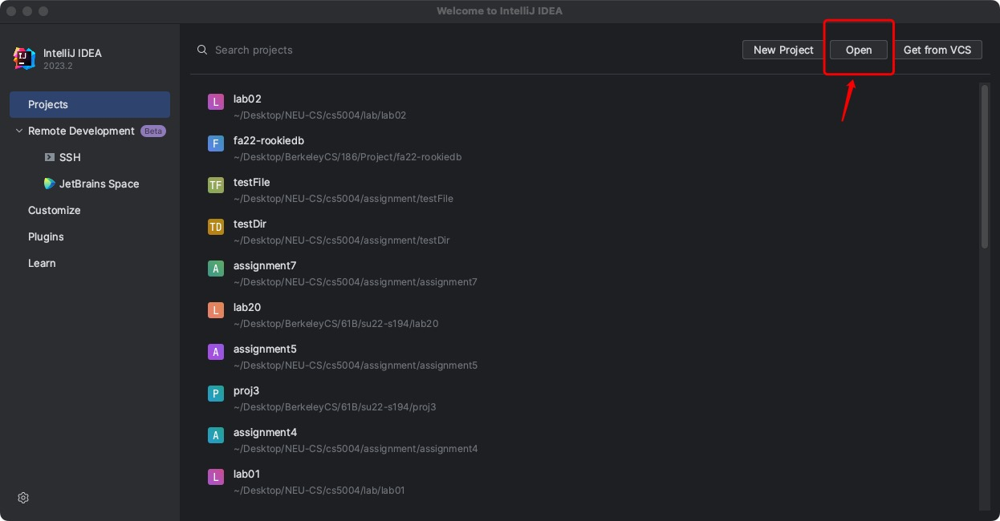

- Select the folder you have just created, then click on trust project, you will enter the IntellJ UI;

  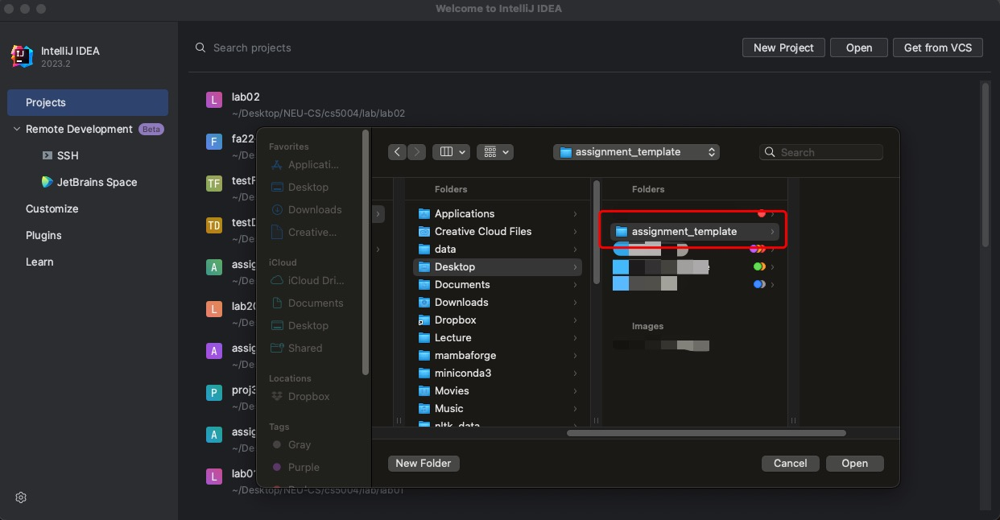

- Right Click on `assignment_template` [a.k.a. the root folder], select `New` -> `Directory`, give name `src`, do the same thing for `test` folder, the following pic show the current status if you successfully reach to this step;

  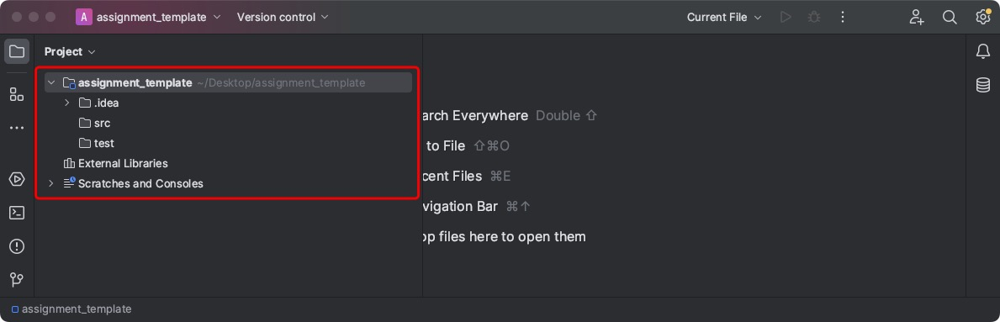

- Go to `Project Structure` located on `File` tab, set up your JDK, you can choose JDK-21, JDK-18 or any other to compile your files. In my case I will choose OpenJDK-20 since that is my regular setting.

  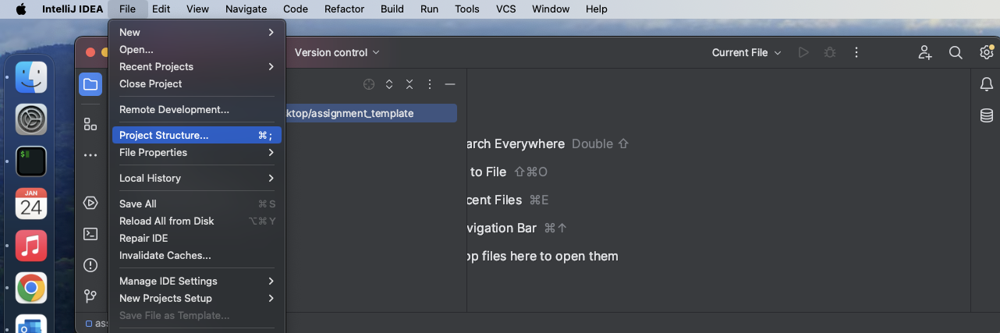

  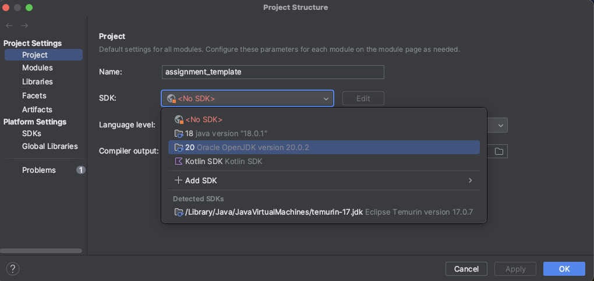

- **This is an important step**. Go to Modules, first single click on `src`, you will notice that `Mark as: ....` row is lighted up, then select `Source`; This step mark you `src` as your source folder;

  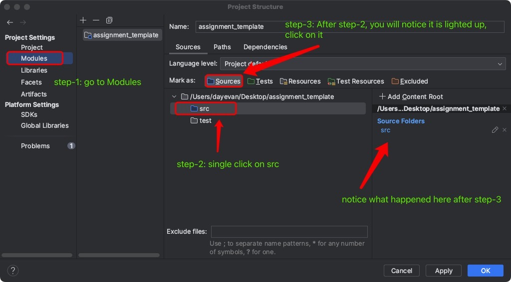

- Similarly, mark `test` as `Test` by singlely clicking on `test` then click `Test` on the `Mark as: ...` row, the result should be looks like the following pic; **Important Step!!!** Save the setting by click on `Apply` then `OK`;

  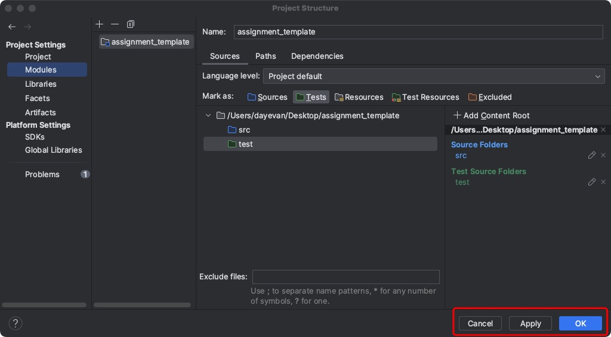

- After the previus step, you will notice the `test` folder turns green!

  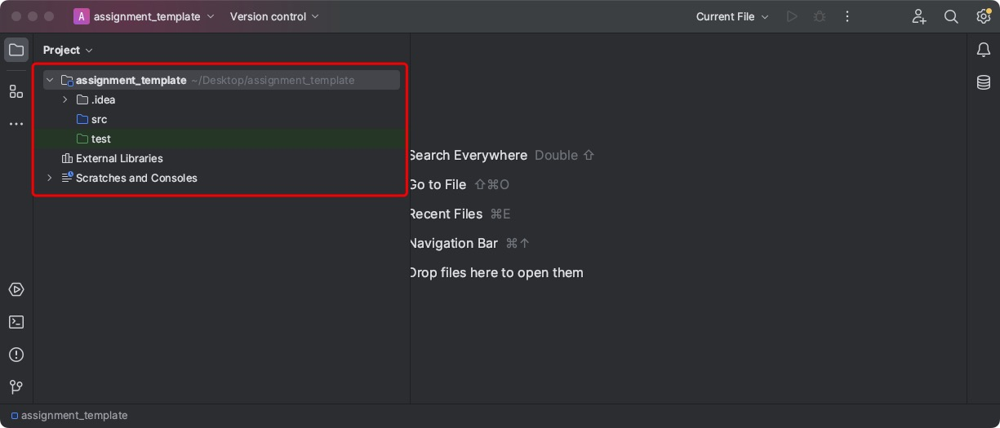

- Go to the `File` -> `New Project Setup` -> `Save Project as Template...`;

  

- Give a name to your current template and add some description to remind you, then click `OK`;

  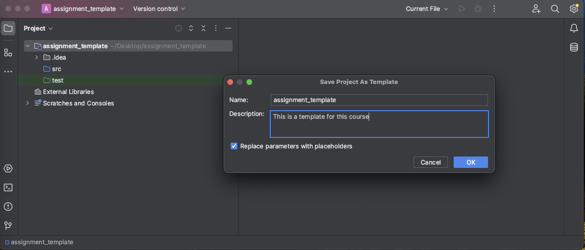

- To use your template, close your IntellJ IDEA and reopn it, select `New Project`; In this case, I give a name `assignmentX`, which is a completed new project; you will notice on the left cornor, you can select your template!! then `Create`!

  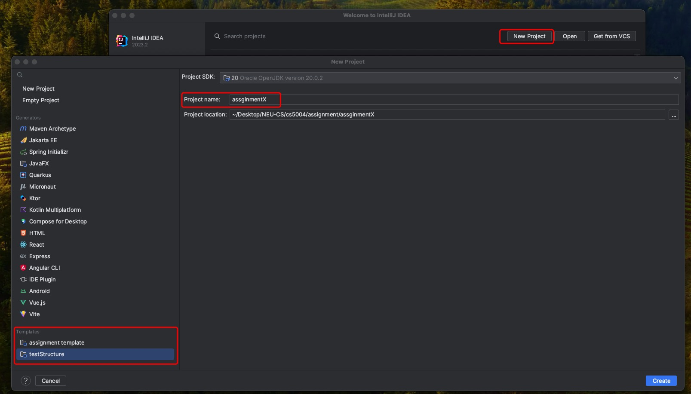

- We make it!!

  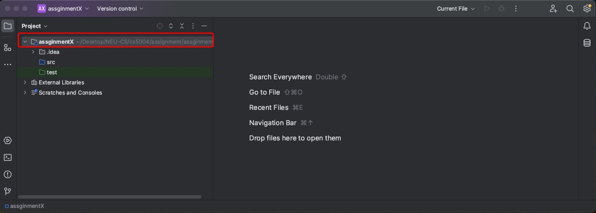

- Let's Test it, add some code in it! It works!

  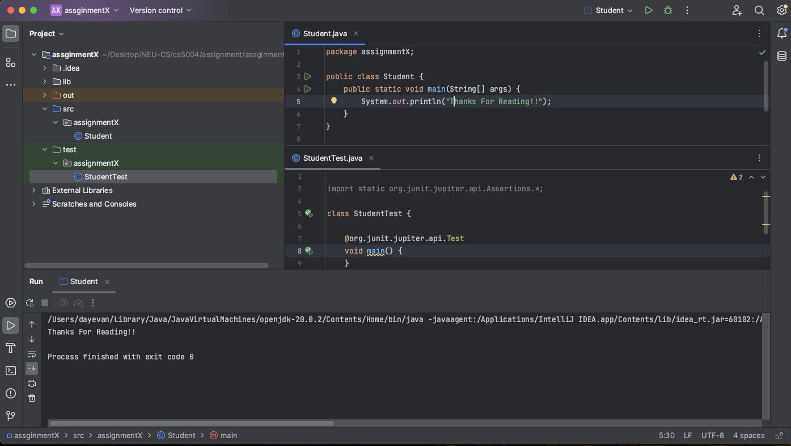

- You can also save the project setting when you create the project using Maven Setting and then later on change it structure (ex. move the `test` directory outside and then save the template);)

## Short Cut To Make Life Easy

#### _I will keep updating this session while exploring it_

- Generate `Getter`, `Setter`, `equals & hashcode`, `constructor` methods: `Command+N` for Mac & `Alt+Insert` for windows (sometimes you also need to `Alt+Fn+Insert`)

  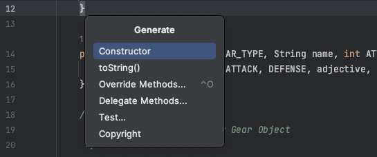

- Quick Search on class method and attributes `shift + shift` [tap shift double time]

  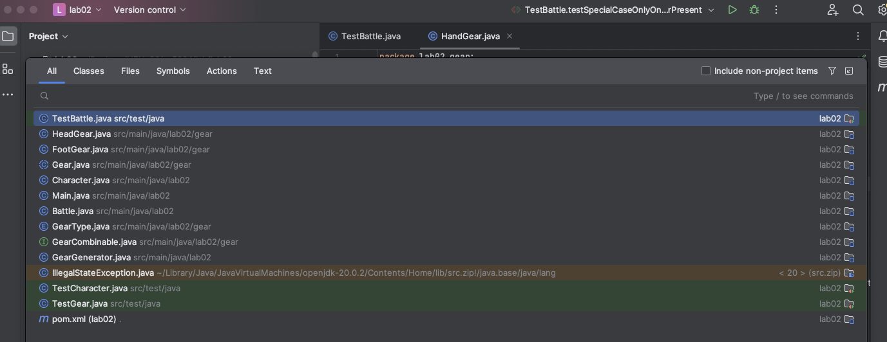

