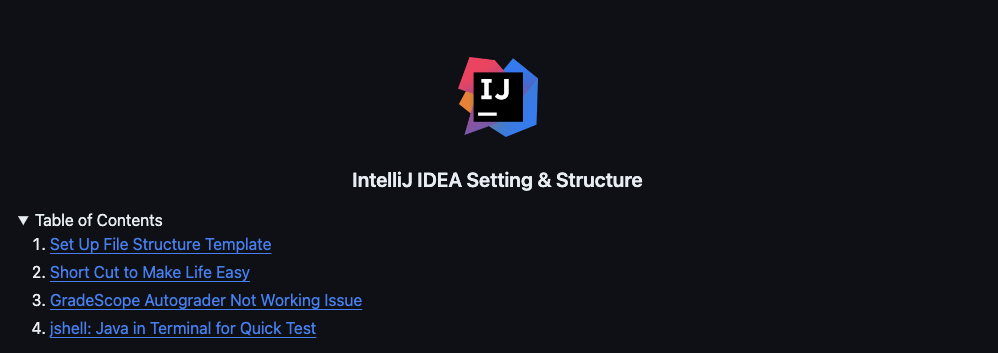
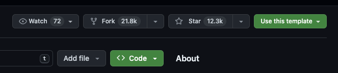
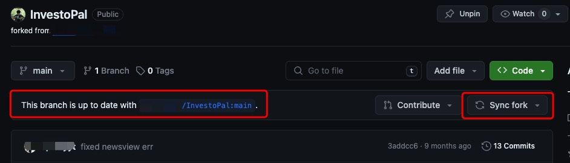
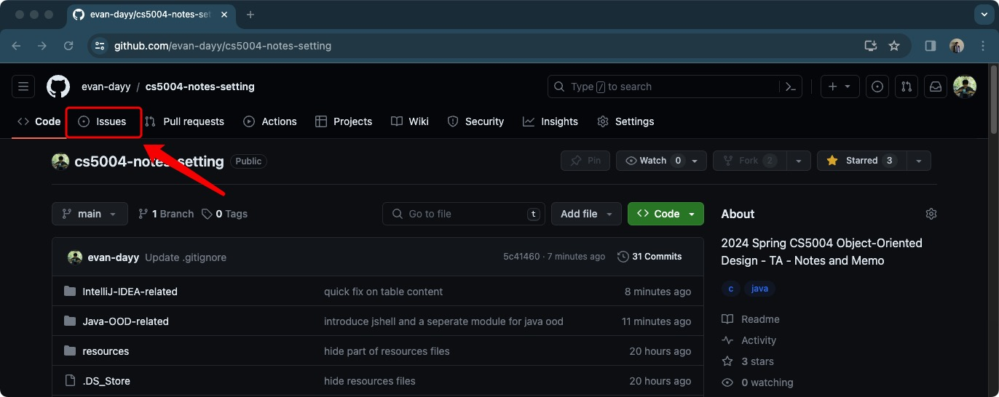
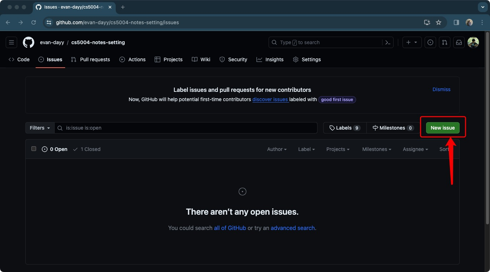
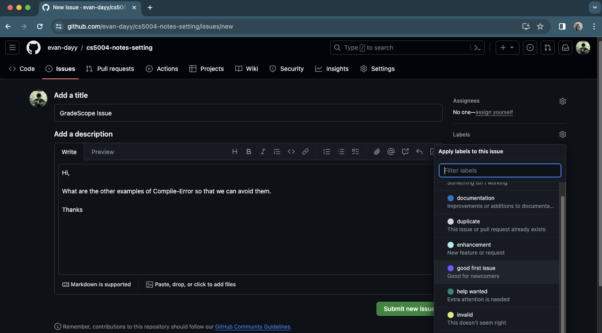
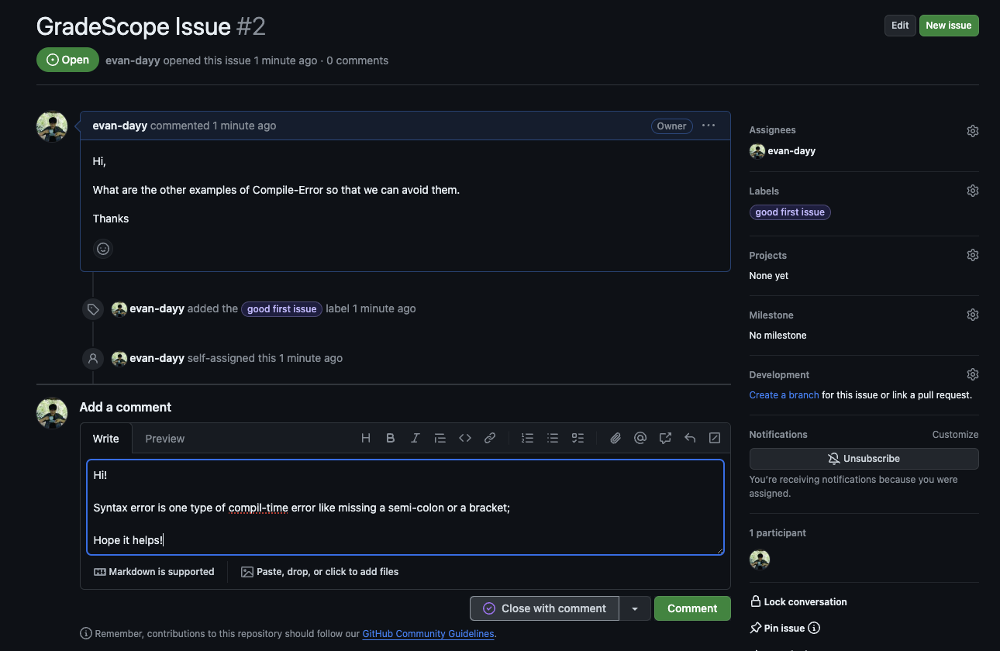

<!-- Improved compatibility of back to top link: See: https://github.com/othneildrew/Best-README-Template/pull/73 -->

<a name="readme-top"></a>


<!-- PROJECT LOGO -->
<br />
<div align="center">
  <a>
    
  </a>
  <h3 align="center">CS5004 Notes & Memo</h3>
</div>

<div align="center">
  
[](https://github.com/evan-dayy/cs5004-notes-setting/pulls)
[](https://www.linkedin.com/in/evandai99/)


</div>

<details>
  <summary>Table of Contents</summary>
  <ol>
    <li><a href="#about-the-notes">About</a></li>
    <li><a href="#save-it-to-your-own-space">Save it to your own Github</a></li>
    <li><a href="#post-an-issue">Submit an issue</a></li>
  </ol>
</details>

## About The Notes

```java
class Notes {
  public static void main (String[] args) {
    System.out.println("Welcome to the memo space :)");
  }
}
```

Hello everyone!! welcome to the 04's memo and notes. The purpose of this repo is to record the common questions and provide a space for people who want to get back to these **Easy-to-Forget** or **Hard-to-Understand** questions in a later time. The repo will be updated in a regular manner.

- This is not a repo that covers all the course material or Java Basics;
- It may covers some concepts that are out-of-scope but good-to-know.

Please refer to course materials and lab notes to get a full view of this course!

There is a `Table of Contents` in every document, click on it to quickly direct yourself to the target!

<div align="center">
  
</div>

## Save it to your own space

For people who wish to see the notes in your own Github repositary, here I provide instructions on how to `fork` it; One of the benefit is that you will see when I update the file and then you can `sync` by clicking one botton;

- You should have your own Github account;
- Click the `Fork` botton on the right cornor near `Code`

<div align="center">
  
</div>

- Follow the instructions showed in the previous step, then you are good to go!!
- Everytime I update the file, you will see some notices here suggest that `you are behind the newest version`; By clicking `Sync fork`, you will get up-to-date docs;

<div align="center">
  
</div>

## Post an issue

If you want to point out there exist a mistake in the document or you believe it may need more explanation, post an `issue` so that I can see it and resolve it! You can also use it as a private discussion, you can ask any question related to these notes through it! Follow these steps to submit an `issue`: 

- Go to `issue` mentioned below:

<div align="center">
  
</div>

- Click on `new issue`, it will pop up a window;

<div align="center">
  
</div>

- Give a title of the issue and then type the details. I make up a question about GradeScope. On the left-hand side, you can choose a label or create a label if you like; Then, click on `Submit new issue`! You successfully submit an `issue`!

<div align="center">
  
</div>

- On my side, I will give a reply and fix the typo or error in the doc, and then let you know by comments or closing the issue;

<div align="center">
  
</div>
